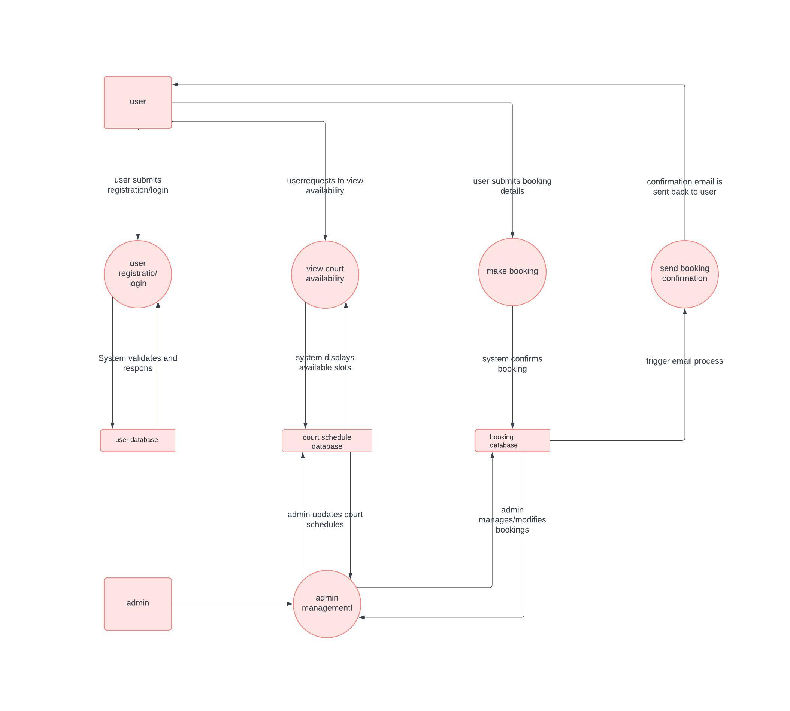
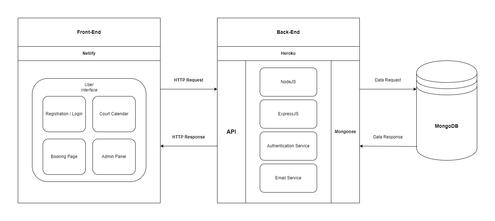

**Burim Saliji - T3A2-A - Full Stack App**
# CourtConnect

---

With the construction of a new tennis court in the vicinity, there is an excellent opportunity to develop a dedicated court hire application. This app aims to streamline the process of booking tennis courts, making it more accessible and efficient for both players and court administrators.

---

## Key Features

### User Accounts (Registration and Login):

**Purpose:** To allow users to create personal accounts for accessing the booking system and to maintain secure login functionality.

**Functionality:**
- Account creation with email verification.
- Secure login with password encryption.

### Court Availability Calendar:
**Purpose:** To provide users with an easy-to-use interface for checking the availability of tennis courts.
**Functionality:**
- Display of available dates and times.
- Real-time updates for accuracy.

### Booking System with Time Slots:
**Purpose:** To enable users to book courts based on their preferences for date and time.
**Functionality:**
- Selection of available time slots for booking.
- Immediate confirmation of bookings.

### Admin Panel for Court Management:
**Purpose:** To provide administrators with tools to manage court schedules and bookings effectively.
**Functionality:**
- Modification of time slots and booking management.
- Handling special requests and booking adjustments.

## Nice to Have

### Send Confirmation Email:
**Purpose:** To provide an automated confirmation to users after they successfully book a tennis court.

**Functionality**
- Automatically triggered email upon successful court booking.
- Personalized email content including booking date, time, court number, and duration.

---

## Target audience
- Local tennis players seeking convenient access to court bookings.
- Tennis court administrators looking for an efficient way to manage bookings and payments.

---

## Technical Stack

**Frontend:** HTML5, CSS3, ReactJS, Javascript, JSX.
**Backend:** NodeJS, ExpressJS.
**Database:** MongoDB, Mongoose.
**Deployment:** MongoDB, Cloud Atlas, Heroku, Netlify.
**Testing:** 
**Project-management:** Trello.
**Utilities:** Lucidchart, Figma.
**DevOps:** Git, Github, VS Code.

---

## User Stories

**Emily**
- What: Emily wants to create a user account on CourtConnect.
- Why: So she can easily book tennis courts, view her booking history, and receive updates about court availability.

**John**
- What: John wants to securely log in to his account each time he uses the app.
- Why: To ensure his personal booking information and history are kept private and secure.

**Alex** 
- What: Alex wants to quickly check the availability of tennis courts for the upcoming week.
- Why: So he can plan his schedule and book a court at a convenient time without having to call the facility.

**Lisa**
- What: Lisa wants to book a tennis court for her practice sessions.
- Why: So she can ensure she has a reserved spot for her regular training sessions.

**Mark**
- What: Mark wants to receive immediate confirmation after booking a court.
- Why: To be assured that his booking was successful and to have the details for his records

**Sarah**
- What: Sarah needs to update the court availability schedule and manage existing bookings.
- Why: To reflect changes in court availability due to maintenance or events and to accommodate special booking requests.

**Mandy**
- What: Rachel wants to make a special booking request for a series of courts for a local tournament.
- Why: To ensure the tournament can be accommodated on the desired dates.

---

## Dataflow Diagram

---

## Application Architecture Diagram

---

### Screenshots

